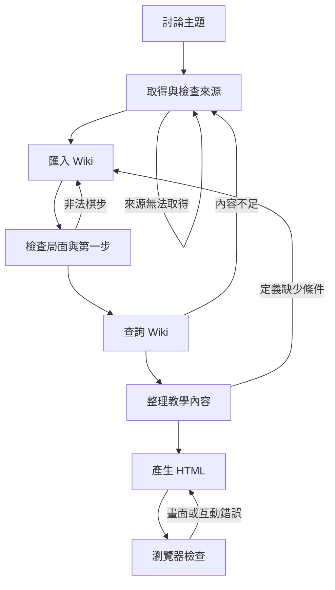

## 流程

```mermaid
flowchart TD
  A[討論主題] --> B[取得與檢查來源]
  B --> C[匯入 Wiki]
  C --> D[檢查局面與第一步]
  D --> E[查詢 Wiki]
  E --> F[整理教學內容]
  F --> G[產生 HTML]
  G --> H[瀏覽器檢查]
  B -- 來源無法取得 --> B
  D -- 非法棋步 --> C
  E -- 內容不足 --> B
  F -- 定義缺少條件 --> C
  H -- 畫面或互動錯誤 --> G
```
